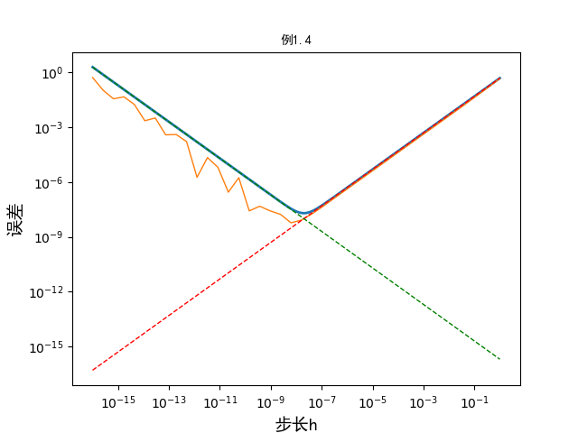
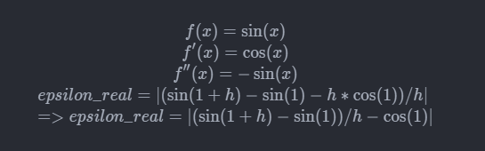
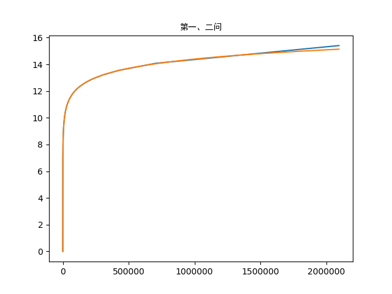

# 第一章
2019/6/11  [返回](https://desperadoadil.github.io/NumericalAnalysis/)

---

## 第一题

- 根据例1.4  
    

## 第三题
  
绿线为单精度，黄线为双精度  
- 第一问
    - 单精度浮点数的尾数为23位，当两个数字相差超过2的24次方倍时，相加就会出现a+b=a的情况，224次方为16777216。
    - 由图中看出大约n=2E6的时候就停止增长了，这里估算和误差相差的原因是：15实际上在2进制里占的位数和8一样，计算224时应该用8除以224，这样算出来的n就是2E6了。
- 第二问
    - 双精度计算到n=2E6的时候双精度计算的结果为15.133306，误差约为0.27。
    - 双精度计算到这里每一次加法的误差不超过1E-15，求和后也不超过2E-9，因此可以认为单精度计算的结果"与精确结果"的误差大约为0.27。
- 第三问
    - 第二问计算用了大约1.85s。
    - 双精度浮点数要达到a+b=a的效果需要a和b成253倍。
    - 用调和级数的近似公式`ln(n+1)+r`可得
        `n*(ln(n+1)+r) < ` 253
    - 计算得n=3E14，此时计算量是上面的1.5E8倍，大概需要2.775E8秒，也就是大概3211天的时间才能计算完毕。
