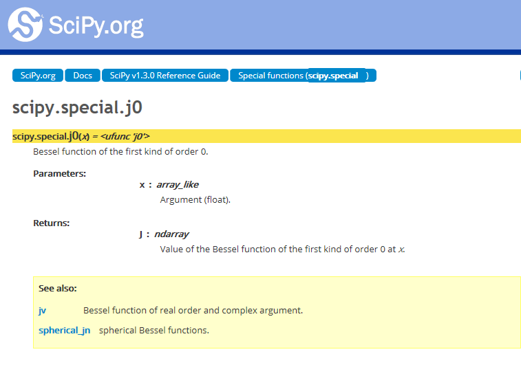

# 第二章
2019/6/11  [返回](https://desperadoadil.github.io/NumericalAnalysis/)

---

## 第二题
将书上的伪代码翻译成Python代码即可  

- 设定初始阻尼因子和误差阈值：
    程序运行后由用户输入，如果用户不输入，那么用默认值0.2和0.001  
    ```python
    lamd0 = input('lambda0:')
    lamd0 = np.float64(lamd0) if lamd0 != '' else 0.2
    eps = input('eps:')
    eps = np.float64(eps) if eps != '' else 0.001
    ```

- 逐次折半法更新阻尼因子：
    ```python
    i = 0
    lamdk = lamd
    while abs(f(xk)) > abs(f(xk_pre)):
        xk = xk_pre - lamdk * s
        lamdk /= 2.0
        i += 1
    ```

- 打印每一个迭代步骤:
    damp为是否使用阻尼因子的开关  
    ```python
    if damp:
        print ("\tlamd%d: %.10f\tx%d: %.10f" % (k, lamdk, k, xk))
    else:
        print ("\tx%d: %.10f" % (k, xk))
    ```

- 其他方法验证结果：
    采用Python scipy.optimize库中的fsolve()函数求解方程，得到结果  
    ```python
    result = fsolve(f1, x0)
    print ("fsolve:\tx = %.10f\tf(x) = %E" % (result, f1(result)))
    ```

- 比较采用阻尼和不采用阻尼算法的效果差别:
    利用damp开关控制是否采用阻尼
    ```python
    ...
    def newton(f, f_, x0, eps1, eps2, lamd, damp=True):
        print ('Damp:') if damp else print ('No damp:')
        k = 0
        xk = x0
        xk_pre = x0
        while abs(f(xk)) > eps1 or abs(xk - xk_pre) > eps2:
            s = f(xk) / f_(xk)
            xk_pre = xk
            xk = xk_pre - s
            if damp:
                i = 0
                lamdk = lamd
                while abs(f(xk)) > abs(f(xk_pre)):
                    xk = xk_pre - lamdk * s
                    lamdk /= 2.0
                    i += 1
            k += 1
    ...

    k, xk = newton(f1, f1_, np.array(x0, dtype=np.float64), eps, eps, lamd0)
    k, xk = newton(f1, f1_, np.array(x0, dtype=np.float64), eps, eps, lamd0, damp=False)
    ```
    效果：  
      
    可以看出，采用阻尼的收敛速度明显高于不采用阻尼的收敛速度。  


## 第三题
- 将书上的fzerotx()函数代码翻译成Python代码即可  
    要注意的是设置eps的值：  
    `eps = 1.0E-10`  
- 注意到Python scipy.special库中提供了第一类零阶贝塞尔函数：  
      
- 求出J0(x)的前10个正的零点：  
    ```python
    list = [0]
    ansX = [0] * 10
    ansY = [0] * 10
    f = j0(0)
    num = 0
    for i in range(1, 50):
        if np.sign(j0(i)) != np.sign(f):            #符号相反说明有零点
            list.append(i)
            f = j0(i)
            ansX[num], ansY[num] = fzerotx(j0, (list[num], i))
            print ("x%d = %.10f\t fx = %.10E" % (num, ansX[num], ansY[num]))
            num += 1
            if num >= 10:
                break

    plt.figure(num="第三题")

    x = np.arange(0, 32, 0.01)                      #画出J0(x)的图像
    y = j0(x)
    plt.plot(x, y)
    plt.plot(ansX, ansY, 'ro')                      #标出零点的位置
    plt.show()
    ```
- 效果：  
      
      
