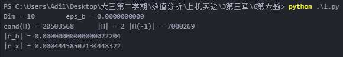
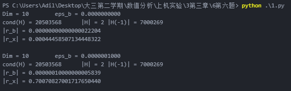
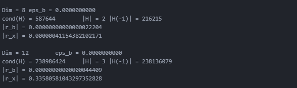

# 第三章
---

## 第六题
- 算法：
    核心函数work():  
    ```python
    def work(dim, eps):
        H = create_H(dim)                                                           #创建希尔伯特矩阵H
        s_1 = np.max(abs(np.sum(H, 1)))                                              #无穷范数
        H_I = np.mat(H).I                                                           #H的逆矩阵
        s_2 = np.max(abs(np.sum(H_I, 1)))                                            #逆矩阵的无穷范数

        x_f = np.ones([dim], dtype=np.float64)                                      #创建x向量
        b = H.dot(x_f)                                                              #b = H*x
        b_eps = b + eps                                                             #b加上扰动
        x_L = figure_x(H, b_eps, dim)                                               #求解方程Hx=b ==>x^
        b_L = H.dot(x_L)                                                            #b^ = H*x^

        r_b = b - b_L                                                               #计算残差r = b - Hx^
        r_x = x_f - x_L                                                             #计算误差x^-x
        print ("Dim = %d\teps_b = %.10f" % (dim, eps))
        print ("cond(H) = %d\t|H| = %d\t|H(-1)| = %d" % (s_1*s_2, s_1, s_2))
        print ("|r_b| = %.20f"% (np.max(abs(r_b))))
        print ("|r_x| = %.20f"% (np.max(abs(r_x))))
        print ()
        return (np.max(abs(r_b)), np.max(abs(r_x)), s_1*s_2)
    ```
    Cholesky分解以及求解方程的函数将书上的伪代码翻译成Python代码即可，细节见代码  

- n = 10，计算残差和误差的无穷范数
    `work(10, 0.0)`，效果：  
      

- 对右端项施加10<sup>-7</sup>，观察残差和误差的无穷范数
    `work(10, 1e-7)`，效果：  
      

- 改变n的值为8、12，观察残差和误差的无穷范数
    ```python
    work(8, 0.0)
    work(12, 0.0)
    ```
    效果：  
      

- 通过这个实验说明了什么问题
    - 巨大的条件数说明Hilbert矩阵的病态矩阵
    - 右端项施加扰动之后，误差变化不大，说明Cholesky分解算法求解方程比较稳定
